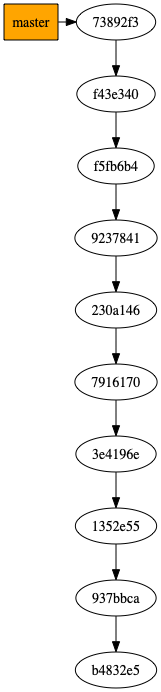

# git-graph
git-graph, a small tool to generate graph visualizations of a Git history
as PNG file.

```
Usage:
  git-graph.py [<from>] [--to=<outpath>]  
  git-graph.py -h | --help
  git-graph.py --version

Options:
  -h --help         Show this screen.
  --version         Show version.
  <from>            Path to repository to visualize [default: ./].
  --to=<outpath>    Path to output image [default: ./git-log.png].

```

## Dependencies

To use this tool you need to have Python 3, Git and Graphviz installed on your system.

On Ubuntu, you may install the latter via:

```bash
sudo apt install graphviz
```


## Example

For example, an illustration of this repository until commit [`73892f3`](https://github.com/HelgeCPH/git-graph/tree/73892f3fe669f1155e6777ced7dcc0ca04c0f561) looks like the following:

